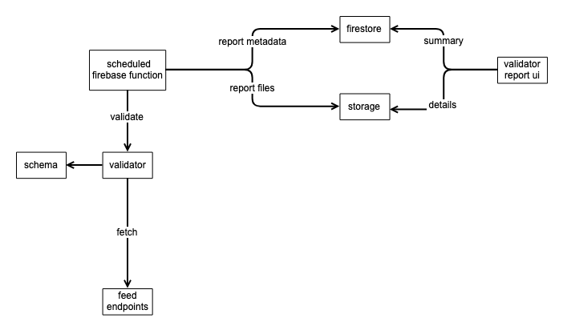

# gbfs-validator-reports

Web app for display GBFS validation reports generated by lamassu.

## Development

Use env variable `REACT_APP_API_BASE_URL` to specify where to fetch reports (e.g. from a locally running instance of lamassu).

## Deployment

Uses firebase CLI for deployment in CircleCI.

### IAM

The deployment service account requires the following roles:

* Cloud Build Service Account
* Cloud Scheduler Admin
* Firebase Admin
* Service Account User
* API Keys Admin
